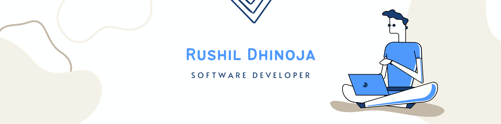

<link rel='stylesheet' type='text/css' media='all' href='./main.css'/>
    
<h2 align="center" ></h2>

<h2>About me</h2>

I am Rushil Dhinoja, currently working as a Frontend Developer Intern [Byju's](https://byjus.com/). I am very keen to learn new technologies and use them to either create something useful or improve the existing softwares.

I love to create things from scratch and build products that can help a group of users.

Also a book worm can read anything Fiction, Non-Fiction, Finance, Economics, etc...

<h2>Summary</h2>
